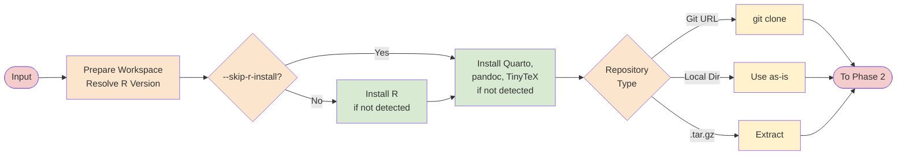
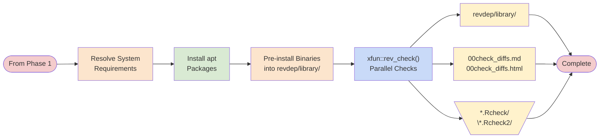

# Workflow

The workflow is almost linear: do all provisioning up front, then run the
checks with minimal surprises.

## Phase 1: provision and prepare

This is implemented in `src/lib.rs` by orchestrating:

- `src/workspace.rs`: workspace directories
- `src/r_version.rs`: resolve R version spec to a concrete installer
- `src/r_install.rs`: install R + tooling (or reuse existing)
- `src/revdep.rs`: prepare repository input

## Phase 2: install dependencies and check

The two key pieces are:

- `src/sysreqs.rs`: resolve + install Linux system requirements for *all* revdeps.
- `src/revdep.rs`: generate deterministic R scripts to install dependencies and
  run `xfun::rev_check()`.

## Workspace layout

By default:

- Remote repos clone next to your current directory.
- Temporary files go in `./revdeprun-work/`.

With `--work-dir`, both clones and temporary files go under that directory.
