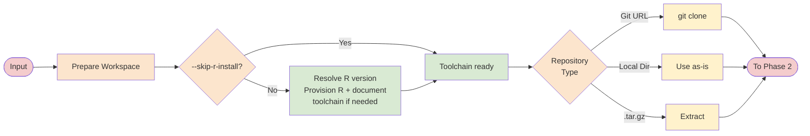
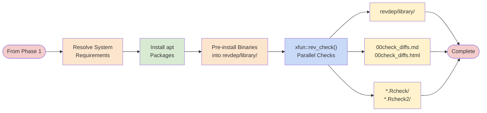

# Workflow

The workflow is almost linear: do all provisioning up front, then run the
checks with minimal surprises.

## Phase 1: provision and prepare

```mermaid
flowchart LR
    Start([Input]) --> Setup[Prepare Workspace]
    Setup --> CheckR{--skip-r-install?}

    CheckR -->|No| Provision[Resolve R version<br/>Provision R + document<br/>toolchain if needed]
    CheckR -->|Yes| Ready[Use system toolchain]
    Provision --> Ready[Toolchain ready]
    Ready --> PrepRepo{Repository<br/>Type}

    PrepRepo -->|Git URL| Clone[git clone]
    PrepRepo -->|Local Dir| UseLocal[Use as-is]
    PrepRepo -->|.tar.gz| Extract[Extract]

    Clone --> Next([To Phase 2])
    UseLocal --> Next
    Extract --> Next

    style Start fill:#f4cccc
    style Next fill:#f4cccc
    style Setup fill:#fce5cd
    style CheckR fill:#fce5cd
    style Provision fill:#d9ead3
    style Ready fill:#d9ead3
    style PrepRepo fill:#fce5cd
    style Clone fill:#fff2cc
    style UseLocal fill:#fff2cc
    style Extract fill:#fff2cc
```

This is implemented in `src/lib.rs` by orchestrating:

- `src/workspace.rs`: workspace directories
- `src/r_version.rs`: resolve R version spec to a concrete installer
- `src/r_install.rs`: install R + tooling (or reuse existing)
- `src/revdep.rs`: prepare repository input

## Phase 2: install dependencies and check

```mermaid
flowchart LR
    Start([From Phase 1]) --> ResolveSys[Resolve System<br/>Requirements]
    ResolveSys --> InstallSys[Install apt<br/>Packages]
    InstallSys --> PreInstall[Pre-install Binaries<br/>into revdep/library/]
    PreInstall --> RunCheck[xfun::rev_check#40;#41;<br/>Parallel Checks]

    RunCheck --> Output1[revdep/library/]
    RunCheck --> Output2[00check_diffs.md<br/>00check_diffs.html]
    RunCheck --> Output3[*.Rcheck/<br/>*.Rcheck2/]

    Output1 --> End([Complete])
    Output2 --> End
    Output3 --> End

    style Start fill:#f4cccc
    style End fill:#f4cccc
    style ResolveSys fill:#fce5cd
    style InstallSys fill:#d9ead3
    style PreInstall fill:#fce5cd
    style RunCheck fill:#c9daf8
    style Output1 fill:#fff2cc
    style Output2 fill:#fff2cc
    style Output3 fill:#fff2cc
```

The two key pieces are:

- `src/sysreqs.rs`: resolve + install Linux system requirements for *all* revdeps.
- `src/revdep.rs`: assemble deterministic R scripts to install dependencies and
  run `xfun::rev_check()`.

## Script assembly

The R code that revdeprun runs lives in plain `.R` files under `assets/r/`
rather than in Rust string literals, so it can be read, linted, and edited with
ordinary R tooling:

- `sysreqs.R`: resolve system requirements and print them as JSON.
- `revdep-prelude.R`: shared workspace, library, parallelism, and pak helper
  setup for the two scripts below.
- `revdep-install.R`: install the package, its dependencies, and its reverse
  dependencies into `revdep/library/`.
- `revdep-run.R`: run `xfun::rev_check()`.
- `patch-pkgdepends.R`: the pkgdepends scheduler and P3M rate-limit patches,
  written to the workspace and sourced by both revdep scripts.

`src/r_scripts.rs` embeds these files into the binary at compile time with
`include_str!`, so a missing file is a build error and the installed binary
never depends on files on disk. Rust keeps ownership of configuration and
orchestration: for each run it renders a short block of R assignments (the
package path, worker count, connection budget, Ubuntu codename, and the paths
of the pkgdepends patch and the shared P3M rate-limit state file), prepends it
to the static sources in order, and writes the result to a temporary file for
`Rscript`. There is no templating step; the `.R` files simply reference the
variables that the configuration block defines, and each file lists the
variables it expects in its header comment. The install and check scripts
receive the same state file path, which is how pak and xfun downloads share one
P3M request budget.

## Workspace layout

By default:

- Remote repos clone next to your current directory.
- Temporary files go in `./revdeprun-work/`.

With `--work-dir`, both clones and temporary files go under that directory.
